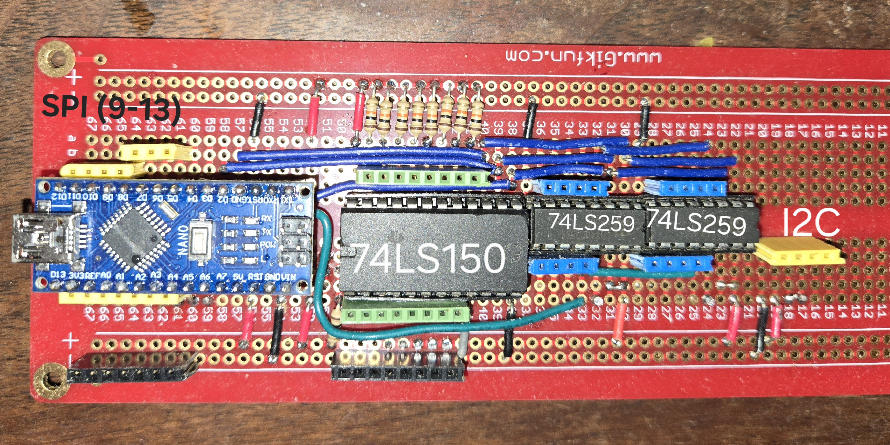

# Plexorino

With additional hardware, we can expand the number of digital input/output pins on the Arduino beyond the bare GPIO provided.

Plexorino brings you skeleton code for multiplexer and demultiplexer to achieve this. Take this logic and use it in your own circuit project.

Note: This is a library. The file **plexorino.ino** contains test cases only.

## Introduction

The most limiting thing about the Arduino is its small number of GPIO pins. So, how to get around this?

Plexorino takes over some of the Arduino's GPIO pins, but repays back many times over. Nothing comes for free! But, the rewards are exponential. For instance, by giving up 5 control pins to Plexorino/demux, you get back 8 outputs, for a net gain of 3 outputs. And for giving up 6 control pins, you get back 16, for a net gain of 10 outputs.

You will need to build some electronics. The parts you need are generally still available, even though some of them were introduced in the 1970s. They are multiplexer/demultiplexer chips, that you can buy on EBay or Amazon pretty easily.

## Use cases

| module          | use case                | I.C. used  | GPIO pins used |
|-----------------|-------------------------|------------|----------------|
| [demux](/plexorino/README_demux.md) | 8-output demultiplexer  | [74HC259](doc/74HC259.pdf)  | 2, 3, 4, 5, A3     |
| [demux](/plexorino/README_demux.md) | 16-output demultiplexer | (2x) [74HC259](doc/74HC259.pdf) | 2, 3, 4, 5, A2, A3 |
| [mux8](/plexorino/README_mux8.md)   | 8-to-1 multiplexer      | [74LS151](doc/74LS151.pdf)  | 2, 3, 4, A0        |
| [mux16](/plexorino/README_mux16.md) | 16-to-1 multiplexer     | [74LS150](doc/74LS151.pdf)  | 2, 3, 4, A0, A1    |

## GPIO optimization

A design goal was to minimize the number of GPIO pins used. In particular:

- We have left pins 9-13 free, which are used by SPI.
- We have left pins A4, A5 free, which are used by I2C.
- We have left pins 6, 7, 8 free, of which pin 6 is PWM-capable.

## Basic setup

This example simply breaks out the 16 inputs and outputs, to connect to a breadboard circuit. The inputs are green, and the outputs are blue.

The SPI and I2C bus are also exposed on the yellow sockets, and pins 6, 7, 8, A0, A1 directly on the Arduino, which weren't used for anything else.

*(Correction: 74LS259 should be 74HC259)*

